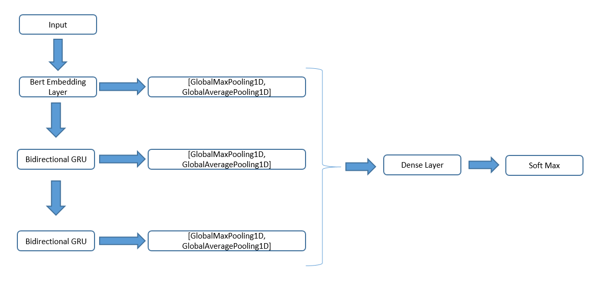

# NLP-ENSAE-Project

This paper details the development and evaluation of an intent classifier for sequence labeling in spoken dialog. 

The model was trained and tested using the SILICONE dataset as the benchmark.

We compared the performance of utterance classifier and context classifier.

We developped three models : 

### BertMLP1Layer: 

The model utilizes the embedding layer of a pre-trained BERT model. Following this, we incorporated a concatenation layer of GlobalMaxPooling1D and GlobalAveragePooling1D after the embedding. The resulting output was then passed through a single neural network layer.

GlobalMaxPooling1D and GlobalAveragePooling1D are commonly used pooling operations in deep learning models, particularly for natural language processing (NLP) tasks.

In the case of NLP, we often have input sequences of variable lengths. The pooling operations allow us to aggregate the information from these sequences into a fixed-length vector that can be passed to subsequent layers of the neural network.

GlobalMaxPooling1D computes the maximum value from each feature dimension across the entire input sequence. This can be useful for capturing the most salient information in the input sequence.

GlobalAveragePooling1D computes the average value from each feature dimension across the entire input sequence. This can be useful for capturing the overall distribution of information in the input sequence.

By using both GlobalMaxPooling1D and GlobalAveragePooling1D in a concatenated layer, we can capture both the most salient information and the overall distribution of information in the input sequence, resulting in a more robust representation of the input that can improve model performance.

The model employs the sparse_categorical_crossentropy as the loss function during the training phase. This loss function is commonly used for multi-class classification problems with integer labels.

Furthermore, we evaluate the model's performance using the 0-1 accuracy metric. This metric measures the percentage of instances where the model correctly predicts the label for the input utterance. In other words, it calculates the ratio of the number of correctly predicted labels to the total number of labels, and then expresses this as a percentage. The 0-1 accuracy metric is a commonly used evaluation metric for multi-label classification problems, where each input can have multiple correct labels.

### BertMLP2Layer:

The main difference between this model and BertMLP1Layer is that we added an additional dense layer before the output layer. 

### BertGRU : 

